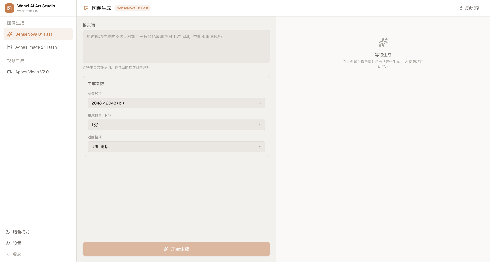

# Wanzi AI Art Studio

[](LICENSE)
[]()

AI 驱动的图像与视频生成工坊，集成 SenseNova U1.5 Lite/Fast 与 Agnes Image/Video 2.5 Flash 四大模型，支持文生图、图生图、图片编辑、文生视频、图生视频等创作方式。



## ✨ 功能特性

- **多模型支持** — SenseNova U1.5 Lite/Fast（商汤文生图与图片编辑）、Agnes Image 2.5 Flash（文/图生图、多图合成）、Agnes Video 2.5 Flash（文/图生视频）
- **图像生成** — 多尺寸档位（1K-4K）、URL / Base64 返回格式、水印开关（SenseNova）
- **图片编辑** — SenseNova U1.5 系列支持参考图编辑功能
- **视频生成** — 720P 固定画质、可调宽高比与时长、支持参考图片生成视频
- **路由架构** — 欢迎页引导设置 API Key，`/image/[model]` 与 `/video/[model]` 独立路由，404 页面处理无效链接
- **历史记录** — Modal 弹出展示，本地持久化最多 100 条，支持回看与管理
- **深色 / 浅色主题** — 基于设计令牌的一致视觉体验
- **隐私优先** — API Key 仅存储在浏览器 localStorage，不传输到任何第三方

## 🚀 快速部署

[](https://vercel.com/new/clone?repository-url=https://github.com/hreign/wanzi-ai-art-studio&project-name=wanzi-ai-art-studio&repository-name=wanzi-ai-art-studio)

> 点击上方按钮即可一键将项目部署到 Vercel。部署完成后访问应用，在欢迎页设置 API Key 即可开始使用。

### 所需环境变量

本项目无需服务端环境变量，所有 API Key 均由用户在浏览器端本地配置。

## 🛠 本地开发

### 前置要求

- Node.js 18+
- pnpm

### 安装与运行

```bash
# 克隆项目
git clone https://github.com/hreign/wanzi-ai-art-studio.git
cd wanzi-ai-art-studio

# 安装依赖
pnpm install

# 启动开发服务器
pnpm dev
```

打开 [http://localhost:3000](http://localhost:3000) 即可使用。

### 配置 API Key

1. 在欢迎页点击「设置 API Key」按钮
2. 根据使用的模型输入对应 Provider 的 API Key
   - **SenseNova** — 前往 [商汤日日新平台](https://platform.sensenova.cn) 获取
   - **Agnes** — 前往 [Agnes AI 平台](https://www.agnes-ai.com) 获取
3. 点击「保存」

> API Key 仅存储在浏览器本地（localStorage），不会发送到任何第三方服务。

## 🏗 技术栈

| 类别 | 技术 |
|------|------|
| 框架 | Next.js 16 (App Router) |
| 语言 | TypeScript (strict) |
| 样式 | Tailwind CSS 4 + CSS 变量设计系统 |
| 图标 | Lucide React |
| 主题 | 自定义 React Context |
| 包管理器 | pnpm |

## 📁 项目结构

```
src/
├── app/                              # Next.js App Router
│   ├── api/generations/route.ts      # API 代理（CORS 转发）
│   ├── image/[modelId]/page.tsx      # 图像模型路由页
│   ├── video/[modelId]/page.tsx      # 视频模型路由页
│   ├── layout.tsx                    # 根布局（主题、字体）
│   ├── page.tsx                      # 欢迎页（模型选择与 API Key 设置）
│   ├── not-found.tsx                 # 404 页面
│   └── globals.css                   # 全局样式与设计令牌
├── components/
│   ├── image-generator/              # 图像生成组件
│   │   ├── image-generator.tsx       # 主容器
│   │   ├── prompt-input.tsx          # 提示词输入
│   │   ├── image-grid.tsx            # 图像网格展示（点击放大）
│   │   └── history-panel.tsx         # 历史记录（Modal 弹出）
│   ├── video-generator/              # 视频生成组件
│   │   └── video-generator.tsx       # 视频生成主容器
│   ├── layout/                       # 布局组件
│   │   ├── app-shell.tsx             # 应用外壳
│   │   └── sidebar.tsx               # 侧边栏导航（路由链接）
│   └── ui/                           # 基础 UI 组件
│       ├── button.tsx                # 按钮
│       ├── input.tsx                 # 输入框
│       ├── textarea.tsx              # 多行输入
│       ├── select.tsx                # 选择器
│       ├── badge.tsx                 # 徽章
│       ├── card.tsx                  # 卡片
│       ├── dialog.tsx                # 对话框
│       ├── modal.tsx                 # 模态框
│       ├── alert-dialog.tsx          # 确认对话框
│       ├── radio.tsx                 # 单选
│       ├── checkbox.tsx              # 复选
│       ├── switch.tsx                # 开关
│       ├── tooltip.tsx               # 提示
│       ├── tabs.tsx                  # 标签页
│       ├── empty-state.tsx           # 空状态
│       ├── image-source-selector.tsx # 图片源选择器
│       └── settings-dialog.tsx       # 设置对话框
├── config/
│   └── models.ts                     # 模型注册表与端点
├── hooks/
│   ├── use-api-key.ts                # API Key 管理
│   ├── use-history.ts                # 历史记录管理
│   ├── use-history-selection.ts      # 历史选择状态
│   ├── use-image-generation.ts       # 图像生成逻辑
│   └── use-video-generation.ts       # 视频生成逻辑（含轮询）
├── services/
│   ├── image-generation.ts           # 图像生成 API 服务
│   ├── video-generation.ts           # 视频生成 API 服务
│   └── history.ts                    # 历史记录存储服务
├── providers/
│   └── theme-provider.tsx            # 主题提供者（自定义 Context）
├── lib/
│   └── utils.ts                      # 工具函数
└── types/
    └── index.ts                      # 类型定义

docs/                                 # 模型 API 文档
├── agnes-image-2.5-flash.md
├── agnes-video-2.5-flash.md
├── sensenova-u1.5-lite.md
└── sensenova-u1.5-fast.md
```

## 🔧 开发命令

```bash
pnpm dev       # 开发模式
pnpm build     # 构建
pnpm start     # 生产运行
pnpm lint      # 代码检查
```

## 🔌 扩展模型

1. 在 `src/types/index.ts` 中扩展 `ModelId` 类型
2. 在 `src/config/models.ts` 的 `MODEL_REGISTRY` 中添加模型配置与端点
3. 在 `src/components/layout/sidebar.tsx` 的 `NAV_GROUPS` 中添加菜单项
4. 根据模型 API 规范在 `src/services/` 中扩展调用逻辑

## 🔒 安全说明

- API 请求通过 `/api/generations` 代理转发至对应模型端点，避免浏览器 CORS 限制
- 请求体大小限制为 10MB
- API Key 仅存储在客户端 localStorage 中

## 📄 许可证

[MIT](LICENSE) © 2026 Hreign Chen
